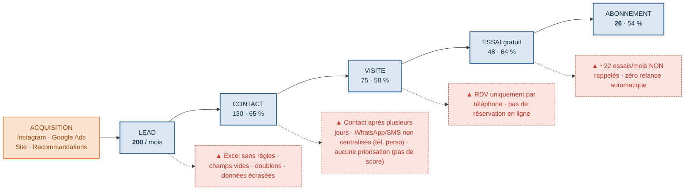

# Processus de vente ACTUEL (AS-IS) — MoveUp

> **Objectif du schéma** : représenter le process *tel qu'il est aujourd'hui* (état A → état B), rendre visibles **tous les irritants** et créer l'urgence.
> 🎯 Logique consultant : **« No pain, no change »** — on montre la douleur avant de proposer le remède (TO-BE au Jour 3).

📎 **Visuel slide-ready** : [03-Processus-vente-AS-IS.png](03-Processus-vente-AS-IS.png) (+ version vectorielle `.svg`).

**Le chiffre qui claque : 200 leads → 26 adhésions = 13 % de conversion · ~22 prospects chauds perdus chaque mois.**

---

## 1. Schéma de process (version éditable — Mermaid)

---

## 2. Le process étape par étape (état A → état B)

| # | Étape (état) | Transition A→B | Outil actuel | Irritants (pain) |
|---|---|---|---|---|
| 1 | **Acquisition → Lead** | Le prospect voit une pub / une reco et fait une demande d'info ou d'essai | Instagram, Google Ads, site | Canal d'origine **non tracé** → ROI inconnu |
| 2 | **Saisie du lead** | Le lead est enregistré à la main | **Excel partagé** | Pas de règles, **champs jamais remplis**, doublons, écrasements |
| 3 | **Lead → Contact** | Le commercial appelle/écrit | Téléphone / SMS / **WhatsApp (tél. perso)** | **Délai de plusieurs jours**, échanges **non centralisés**, **aucune priorisation** |
| 4 | **Contact → Visite** | Prise de RDV pour visiter la salle | Téléphone | **Pas de réservation en ligne**, parcours 100 % manuel |
| 5 | **Visite → Essai** | Séance d'essai gratuite | Sur place (coach/commercial) | Suivi **non partagé** entre accueil, coachs et commercial |
| 6 | **Essai → Abonnement** | Proposition d'offre puis signature | Contrat papier / Excel | **~22 essais/mois non rappelés**, **aucune relance auto**, argumentaire variable |

---

## 3. Irritants transverses (toute l'organisation)

| Axe | Irritant |
|---|---|
| **Organisation** | **1 seul commercial** → prospects « orphelins » s'il est absent · rôles flous (le gérant gère la salle **ET** vend) · faible coordination accueil/coachs/commercial |
| **Pilotage** | **Aucun KPI fiable** · reporting manuel en fin de mois · pas de vision temps réel · aucun objectif de conversion |
| **Marketing** | **ROI par canal inconnu** · pas de scénario de relance (J+1, J+3, post-essai) · **1 200 adhérents non exploités** (pas d'upsell ni de parrainage) |
| **Méthode** | Aucune méthode de vente standardisée · règles de passage entre étapes non définies (quand un lead est-il « perdu » ?) |

---

## 4. Couverture par le dictionnaire de variables (réponse : aucune MAJ nécessaire)

> Chaque irritant ci-dessus est **déjà matérialisable** avec les variables de la v2 du dictionnaire. Le modèle data est donc complet pour soutenir le diagnostic et le prototype.

| Irritant | Variable / KPI qui le capture (dictionnaire v2) |
|---|---|
| Excel sans règles, champs vides | Règle de **complétude** (NULL interdit au passage d'étape) · `notes` souvent NULL |
| WhatsApp/SMS non centralisés | `fact_interaction.type_interaction` (`whatsapp`/`sms`) + **`centralise = faux`** |
| Contact trop tardif | `date_creation`, `date_premier_contact` → KPI **speed-to-lead** |
| Pas de priorisation | `score` · `mrr_estime` · `probabilite_close` |
| Dépendance à 1 commercial | **`proprietaire_id`** sur chaque lead |
| Essais non rappelés | `fact_rdv.relance_post_essai` · `raison_perte = sans_reponse_post_essai` |
| ROI canal inconnu | `source` + KPI **CPL / CAC / conversion par canal** |
| Pas de KPI / reporting | Toute la couche **KPI (§5 du dictionnaire)** |
| Upsell dormant | `utilisation_coaching` · `type_abonnement` · `score_risque_churn` |
| Funnel mal défini | Référentiel **`statut_lead`** (étapes) + critères de passage |

**Option (si vous voulez aller plus loin)** : ajouter un compteur dénormalisé `nb_relances` sur `fact_lead` pour suivre directement « combien de relances par prospect » — sinon, il se calcule depuis `fact_interaction`.
