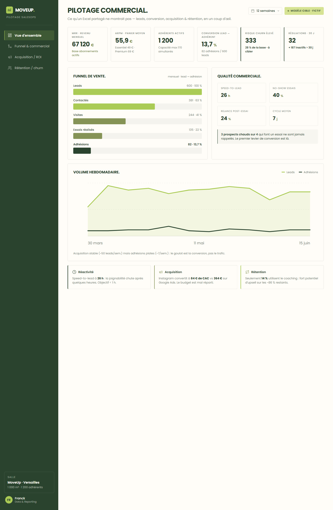

# Dashboard MoveUp — Prototype SalesOps (Jour 4)

Dashboard de **pilotage commercial** MoveUp, branché sur le jeu de données **CIBLE**.
Il rend visible ce qu'un simple Excel ne permettait pas de voir.



**Deux versions** (mêmes données, même design MoveUp — Poppins, crème `#FFFDF8` / vert `#2A432E` / lime `#AACB55`) :

| Version | Fichier | Pour qui |
|---|---|---|
| 🎯 **HTML fidèle** (recommandé démo) | [`index.html`](index.html) | **Pixel-fidèle** à la maquette Claude Design. Ouvre direct dans le navigateur (double-clic), zéro install, hébergeable GitHub Pages. Onglets + filtres en JS. |
| 🐍 **Streamlit** (interactif Python) | [`app.py`](app.py) | App data-driven, thème MoveUp approché (Streamlit ne permet pas le pixel-perfect). |

## 🎯 Version HTML (la plus fidèle)

Ouvre simplement **`dashboard/index.html`** dans un navigateur (double-clic) — rien à installer.
Données réelles intégrées, 4 onglets cliquables, table adhérents filtrable, graphes SVG.

## ▶️ Version Streamlit

**Avec `uv`** (recommandé — environnement reproductible via `pyproject.toml` + `uv.lock`) :

```bash
uv sync                                # crée le venv et installe les dépendances
uv run streamlit run dashboard/app.py
```

Ou avec **pip** :

```bash
pip install -r dashboard/requirements.txt
streamlit run dashboard/app.py
```

Le navigateur s'ouvre sur `http://localhost:8501`.

> Dépendances déclarées dans le `pyproject.toml` **à la racine** du repo.
> Pour (re)générer les jeux de données / documents : `uv sync --group generators`.

## 🧩 Structure

| Fichier | Rôle |
|---|---|
| `data.py` | Couche données **pandas pure** : charge les CSV CIBLE et calcule funnel, KPI, ROI, churn. Testable seule (`python dashboard/data.py`). |
| `app.py` | Interface **Streamlit** : KPI, graphiques Plotly, onglets, callouts de diagnostic. |
| `requirements.txt` | Dépendances. |

> Le chemin des données est **auto-détecté** (`data-cible/` ou `Data base/data-cible/`),
> robuste aux réorganisations du repo.

## 📊 Ce que montre le dashboard

- **KPI** : MRR, ARPM, adhérents actifs, conversion, churn, adhérents à risque.
- **Funnel & commercial** : entonnoir Lead→Adhésion, speed-to-lead, no-show, relance post-essai, volume hebdo.
- **Acquisition / ROI** : CAC & CPL par canal (l'insight Instagram vs Google Ads), parrainage.
- **Rétention / churn** : segments de risque, inactifs, potentiel d'upsell coaching, base adhérents filtrable.
- **Données** : explorateur des 11 tables du modèle CIBLE.
